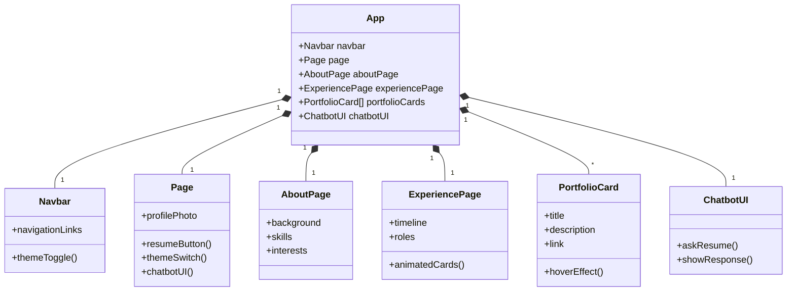

# 🚀 Sumiksh Portfolio2x

A modern, theme-aware portfolio built with **Next.js**, **Tailwind CSS**, and **shadcn/ui**.

## 🗂️ UML Diagram (Mermaid)



## ✨ Features

- 📱 **Responsive landing page** with animated profile photo  
- 🌗 **Global dark/light theme toggle**  
- 🧭 **Navigation bar** with Home, About, and Experience pages  
- 🤖 **Chatbot UI** for resume Q&A  
- 🖼️ **Portfolio cards** with interactive hover effects  

---

## 📄 Pages

### 🏠 Main Landing Page [`src/app/page.js`]
- Displays your name, tagline, and animated profile photo
- Resume and contact buttons
- Theme switch button for dark/light mode
- Chatbot UI for resume queries

### 👤 About Page [`src/app/aboutpage/page.js`]
- Overview of your background, skills, and interests
- Navigation via the navbar

### 💼 Experience Page [`src/app/experiencepage/page.js`]
- Timeline of work experience and roles
- Animated timeline and interactive cards

### 🧩 Navbar [`src/components/ui/navbar.js`]
- Fixed navigation bar with theme toggle
- Adapts colors based on selected theme

### 🗂️ Portfolio Card [`src/components/PortfolioCard.js`]
- Displays project title, description, and link
- Scales and changes color on hover

---

## 🎨 Theming

- Uses `next-themes` and **shadcn/ui** for dynamic dark/light mode  
- All colors and backgrounds adapt automatically

---

## 🛠️ Getting Started

1. **Install dependencies:**
   ```bash
   npm install
   ```
2. **Run the development server:**
   ```bash
   npm run dev
   ```
3. **Visit:** [http://localhost:3000](http://localhost:3000)

---

## 🧑‍💻 Customization

- Update profile photo in `public/profile.jpg`
- Edit resume data in `src/app/api/chat/route.js`
- Change theme colors in `src/app/globals.css`

---

## 🚢 Deployment

- Deploy to [Vercel](https://vercel.com/) or any platform supporting Next.js

---

## 📬 Contact

Feel free to reach out or contribute!